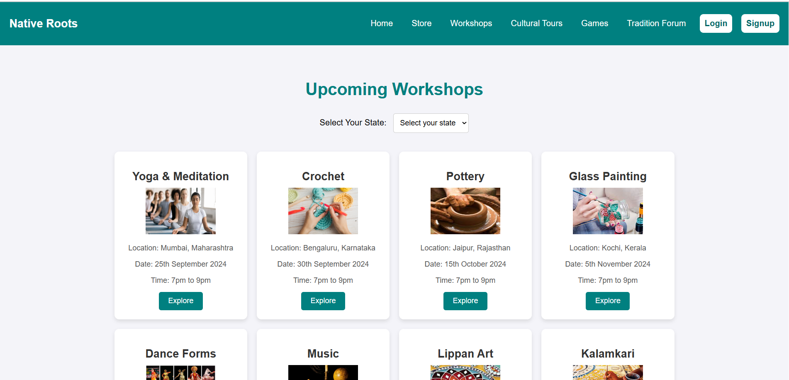
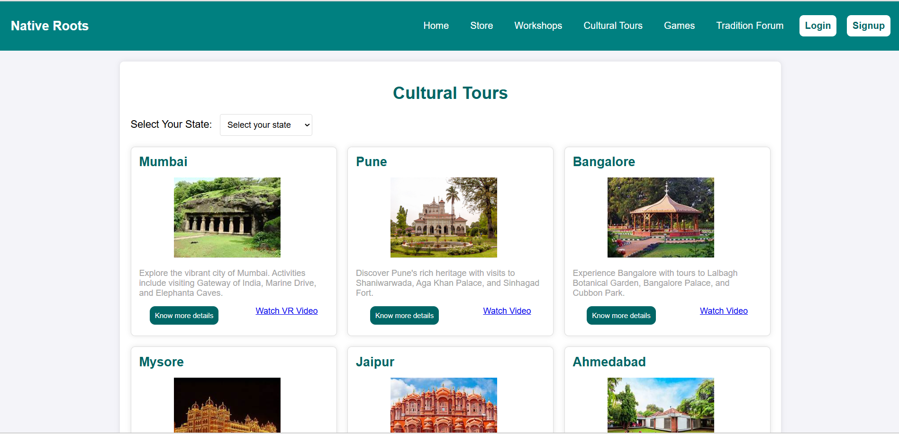
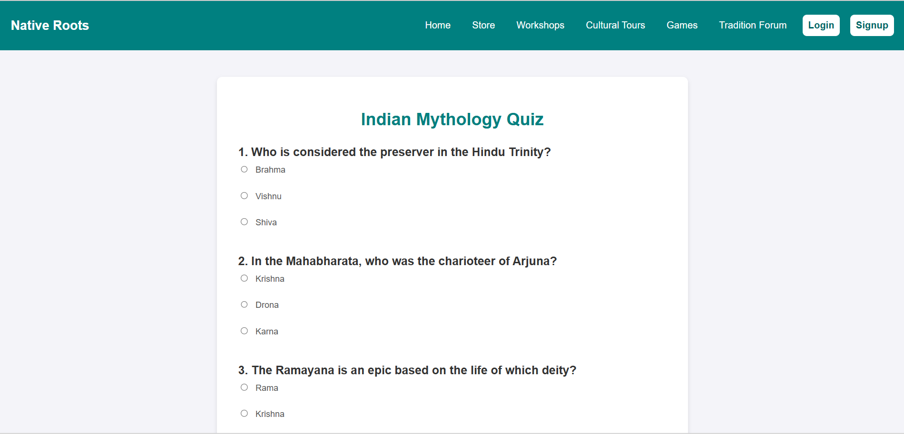

# 🌿 Native Roots

**Native Roots** is a web platform that celebrates and preserves the rich cultural heritage of India.  
It connects people with Indian traditions through immersive tours, interactive workshops, fun games, and a cultural shop.

---

## 🚀 Features

- 🏞️ **Cultural Tours**  
  Explore historical landmarks, festivals, and regional traditions across India.

- 🛠️ **Workshops**  
  Hands-on experiences like pottery, folk arts, classical dance, and regional cuisine.

- 🎮 **Traditional Games**  
  Revisit ancient Indian games in a digital and interactive way.

- 🛍️ **Culture Shop**  
  Buy and sell handmade, traditional, or culturally inspired products.

---

## 📂 Tech Stack

- HTML  
- CSS  
- JavaScript  

---

## 📸 Screenshots

### 🏠 Home Page


### 🛠️ Workshops Page


### 🏞️ Cultural Tours Section


### Quiz


---

## 🔧 How to Run Locally

Clone the repository:

```bash
git clone https://github.com/your-username/Native-Roots.git

Then open the project folder, and double-click on index.html to view it in your browser.
Alternatively, use a Live Server extension in VS Code for a smoother development experience.
